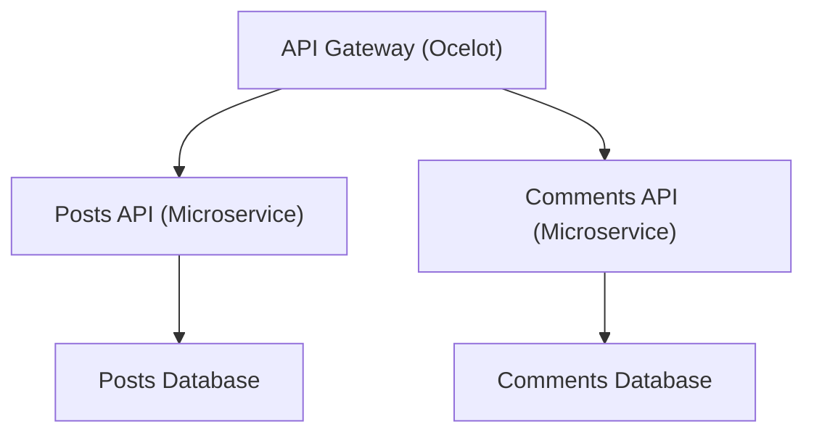

# ✨ ExampleMicroServices

**ExampleMicroServices** is a **production-ready microservices backend solution** built with **ASP.NET Web API**, demonstrating **modern .NET architecture patterns** applied to a real-world system.

It showcases:

- **Domain-Driven Design (DDD)**
- **Clean Architecture (CA)**
- **Vertical Slice Architecture (VSA)**
- **Event-Driven Architecture (EDA)**

The system consists of two independent microservices — **Posts** and **Comments** — managed through a centralized **API Gateway** powered by **Ocelot**.

This project demonstrates **100% line and branch test coverage**, emphasizing **quality**, **reliability**, and **Test-Driven Development (TDD)**.

---

### 💡 Why This Project?

This project demonstrates **microservices architecture** in .NET. It highlights:

- **Scalable**, **maintainable design** with **DDD**, **CA**, **VSA**, and **EDA**
- **Reliable code** through **TDD** with **100% test coverage**
- **Real-world DevOps practices** using **Docker** and **NUKE CI/CD pipelines**
- A **portfolio-ready example** showcasing advanced backend and microservices skills

---

### 🏗️ Architecture Overview

- **Independent microservices** with clear bounded contexts, reducing coupling
- **Centralized API Gateway** for routing and aggregating APIs
- **Clean separation of concerns** across application layers
- **Event-driven communication** for scalable, loosely coupled services
- **Containerized local environment** for consistent development and testing

---

### 🖼️ System Architecture Diagram



---

### 🛠 Core Technologies

| **Category**                      | **Technologies**                                        |
| --------------------------------- | ------------------------------------------------------- |
| **Backend & APIs**                | ASP.NET Web API, FastEndpoints, MediatR                 |
| **Persistence & Mapping**         | Entity Framework Core, AutoMapper                       |
| **Validation & Results Handling** | FluentValidation, FluentResults                         |
| **API Gateway & Documentation**   | Ocelot, Swagger                                         |
| **Testing**                       | NUnit, Moq, FluentAssertions, AutoBogus, Testcontainers |
| **DevOps / CI-CD**                | Docker, Docker Compose, NUKE Build                      |


---

### ⚙️ Build & CI/CD

The solution uses **NUKE-based automation** to streamline builds, testing, and local orchestration.

#### Available NUKE Commands

- `Clean` – Clean build artifacts
- `Restore` – Restore dependencies
- `Compile` – Build the solution
- `Test` – Run all tests and generate report
- `DockerComposeUp` – Start all services
- `DockerComposeDown` – Stop all services

---

### 🏃 Running the Solution

Start all services:
```bash
nuke DockerComposeUp
```

Stop all services:
```bash
nuke DockerComposeDown
```

---

### 🌐 Service Endpoints

| Service          | URL                                            |
| ---------------- | ---------------------------------------------- |
| **API Gateway**  | [http://localhost:5000](http://localhost:5000) |
| **Posts API**    | [http://localhost:5001](http://localhost:5001) |
| **Comments API** | [http://localhost:5002](http://localhost:5002) |

---

### 🎯 Key Achievements & Highlights

- **End-to-end microservices implementation** in **.NET**, demonstrating professional-level backend expertise
- **100% test coverage** using **TDD** practices
- **CI/CD-ready solution** leveraging **Docker** and **NUKE** for automated builds and orchestration
- **Clean**, **scalable architecture** using modern design patterns and event-driven communication
- Ideal portfolio project for **backend**, **microservices**, or **DevOps-focused roles**